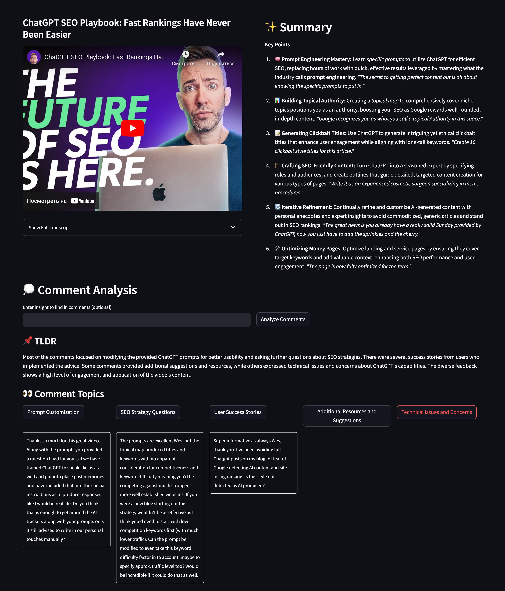

# 🦉 Eightify

> _~~Bad~~_ Minimalistic [eightify.app](https://eightify.app) clone with a new
> feature explored

## 👽 Description (wanna-be)

- ⏱️ Save time on long videos, get key ideas instantly
- 📚 Eightify helps when you're swamped with too much content
- 🧠 It's an AI YouTube tool which finds the key points in topics like AI,
  Business, Finance, News, or Health
- 🚀 Eightify boosts your learning
- 🎯 Grasp the gist of any video in seconds with our YouTube summary AI
- <u> _**NEW**_: 🦜 Get insights from comments at breeze with the comment
  groups</u>
- 🔍 Navigate through videos with ease using summarized paragraphs with
  timestamps
- 💡 Get the pivotal points and key ideas from the video
- 🌍 Access translations of summaries in your preferred language. No more
  language barriers with Eightify!



## 💅 Try the MVP

**<u>[here](https://eightify-fsg7quclhq-uc.a.run.app)</u>**

I'm not completely sure it will work good with any video at the current moment,
but these worked fine for me:

- [ChatGPT SEO Playbook: Fast Rankings Have Never Been Easier](https://www.youtube.com/watch?v=o_40XFrrBf4)
- [What Enlightenment Does to Your Brain](https://www.youtube.com/watch?v=qwQrwPhK06I&list=FLeza2gg4Htx0Z8xy0QHqUWA&index=2)

## 📓 Table of contents

- [🦉 Eightify](#-eightify)
  - [👽 Description (wanna-be)](#-description-wanna-be)
  - [💅 Try the MVP](#-try-the-mvp)
  - [📓 Table of contents](#-table-of-contents)
  - [👾 Why do this](#-why-do-this)
    - [🤟 Example](#-example)
  - [🎼 System design](#-system-design)
    - [💘 General pipeline](#-general-pipeline)
    - [👹 Design decisions](#-design-decisions)
    - [💸 Unit economics](#-unit-economics)
  - [👻 Usage](#-usage)
    - [Local run](#local-run)
    - [In docker/on GCP](#in-dockeron-gcp)
  - [🧑‍💻 Development](#-development)
  - [🏗️ Project structure](#️-project-structure)
  - [💔 Troubleshooting](#-troubleshooting)
  - [🧑‍🎨 TODO:](#-todo)
  - [©️ License](#️-license)

## 👾 Why do this

- 😶‍🌫️ My main focus in this app was to add a comment analyzer feature because it
  was lacked in the app. They only show one-sentence TLDR and then comments in
  the exact order that YouTube shows them.

- 💠 There's **so much** insights hidden in the comments section and not
  expressed by TLDR. Like, is there any manipulations by the political speaker
  in the interview, or any personal stories.

- 💖 I personally sometimes spend more time reading the comments than watching
  the actual video, or read comments before starting the video, and if there was
  a tool that could help me reliably do that analysis, I'd pay for it even more
  than for a video summarizer.

- 🍓 I wouldn't use the app in its current development state, but it's a nice
  PoC that this could really work.

### 🤟 Example


- You can filter comments based on what you want to find there (or analyze
  everything).

- Categorize based on this insight request (notice how topics changed from the
  previous screenshot).

- Compare it with the mess of YouTube comments. No "thank you, loved it", easier
  to orient, nice grouping.

  

## 🎼 System design

### 💘 General pipeline

- Get the video description, transcript, comments from YouTube API
- Summarize the video using LLM
- Render the summary and ask for user's interest in the comments
- Feed the given summary, video description and comments to the LLM
- Auto-cluster the topics of the comments in one pass to LLM: ask to both find
  topics and assign comments to topics
- Render the comment analysis grouped by comment topics to quickly filter this
  mess

### 👹 Design decisions

- I use raw calls to OpenAI API instead of LLM framework because I don't want an
  unnecessary complexity for the MVP

- I set the desired format for the summary and comment analysis with OpenAI's
  function calling. Like this

  ```python
      Provide the summary as a JSON array of objects. Each object should have the following structure:
    {{
        "emoji": "Relevant emoji",
        "title": "Bold title (max 5 words)",
        "content": "Concise paragraph combining main idea, practical implications, and examples",
        "quote": "Brief, impactful quote from the video",
    }}

    ............................................................................................

    {{
        "topics": [
            {{"name": "Topic Name", "description": "Brief description of the topic"}}
        ],
        "comment_assignments": [
            {{"comment_index": 0, "topic_indices": [0, 1]}}
        ],
        "overall_analysis": "Your overall analysis of the comments and topics"
    }}
  ```

  LLMs are actually pretty good at following formats using function calling or
  other means of structured generation (like
  [outlines](https://github.com/outlines-dev/outlines)).

- I wrote a "disgustingly long"
  [system prompt](./src/eightify/api/llm/base.py#L10) trying to achieve the best
  possible summary quality. "How would I summarize the video myself"? Problems I
  tried to solve:

  - **Boring**, boilerplate, robotic, timewasting, filler: content that I
    wouldn't want to read
  - **Reliability/Recall**: I want to be sure I'm not missing anything important
  - **Precision**: AI didn't make things up
  - **Filtering**: Find real gems in there

    This isn't the best solution to the problem, but prompt engineering is at
    the core of this business → would be improved iteratively.

- We might miss some in comment analysis because of fetching top-N and
  auto-filtering by what LLM finds important, but if users want to go to the
  comments section, they'll do it anyways. We don't want to replace the comments
  section; our summaries still offer valuable insights.

  - In some sense, it's the same with summarization that we hope that LLM will
    remove the stuff we ourselves would consider irrelevant. If we trust it
    there, we should trust here as well.

- 😒 I don't support translations and non-English language videos at the moment.
  Because we need to write a correct logic on which transcript to fetch:
  - Is manually generated in Deutch better than auto-recognized English?
  - Is manually generated Russian better than auto-translation from Russian to
    English for our model?
  - Should we output in English either way or introduce other language to the
    prompt? We need to separately test this functionality

### 💸 Unit economics

- gpt-4o costs $5/mln input + $15/mln output tokens

- For [this 15-minutes long video](https://www.youtube.com/watch?v=O0H2m_r-ZhI)
  we have 10k input tokens and 1k output tokens. This includes both system
  prompt and user prompt for summary and comment analysis.

- The cost of one video summary is then: $0.05 + $0.015 = 7 cents per video 🐜

- Let's assume we charge $4/user/month, the average user summarizes 20 videos
  per month and 50% of the summarized videos are watched by more than one user

- 20 \* 0.5 \* 0.07 = $0.7 per user. Seems good for short videos. We can even
  pay our developers and AWS bills 🤗

## 👻 Usage

### Local run

- Install in venv
  `python -m venv .venv && source .venv/bin/activate && pip install -r requirements.lock`
- Put creds in `.env`
- Start the backend in one terminal: `fastapi run src/eightify/main.py`
- Start the frontend in another terminal: `streamlit run src/eightify/app.py`
- Enjoy your time in the browser interface:
  [http://localhost:8501](http://localhost:8501)

### In docker/on GCP

I deploy to Google Cloud Run and it wasn't easy to deploy both frontend and
backend to run from one service → so for now I start them in one python process.

Correct way would be to setup `docker-compose` for local builds, with different
docker images for frontend and backend, for cloud — setup separate containers in
GCR service, communicate with authentication.

I don't need any scaling for now, so coupling of the services is not a problem.
For future:
https://www.googlecloudcommunity.com/gc/Community-Blogs/No-servers-no-problem-A-guide-to-deploying-your-React/ba-p/690760

- Put creds in `.env` (be aware of API bills, put rate limits if you're hosting
  this)
- `docker build -t eightify .`
- `docker run -p 8000:8000 -p 8501:8501 --env-file .env eightify`

## 🧑‍💻 Development

- Install rye — yet another package manager, but from the creators of ruff:
  `curl -sSf https://rye.astral.sh/get | bash`
- Install env `rye sync`
- Install pre-commit hooks: `pre-commit install`
- Put creds, override config params in `.env`
- Run tests: `rye run pytest` (needs API keys to test youtube and openai api
  usage)
- Test backend from swagger docs: `127.0.0.1:8000/docs`

## 🏗️ Project structure

- `main.py` — backend on FastAPI
- `app.py` — fronted on Streamlit
- `cloud_app.py` — run both in the same process (for deployment)
- `api/youtube.py` — API calls to YouTube (descriptions, transcripts, comments)
- `api/llm/base.py` — interaction with LLM, system prompt, debug logs
- `api/llm/summary.py` — summary prompt and response parsing
- `api/llm/comments.py` — comments prompt and response parsing
- `config.py` — configuration with `pydantic-settings`
- `common.py` — common types used in different parts of backend and frontend
- `utils.py` — utils

## 💔 Troubleshooting

- SSLError while fetching YouTube data. When deploying from GCP, sometimes
  YouTube blocks requests and you get SSLError. While I'm fixing it, just
  refresh the page 🪄

- Comments not found: if there's <10 comments on video, you can make it
  yourself.

- Transcript not ready: if your video doesn't have a transcript, you'll get an
  error. We cannot analyze videos without transcripts yet.

## 🧑‍🎨 TODO:

Approximately prioritized

- **Automatic evaluation pipeline**

  - It's already a little bit unclear for me when one result is better than
    another
  - Crucial for scaling the project
  - All prompt evolution should be evaluated through it
  - (maybe) using LLM framework — to not reinvent the wheel

- **Optimize the prompt**

  - Currently it's 5k+ tokens of input, may safely remove half of it
  - The result is not the best it can be...
  - Maybe use [TextGrad](https://github.com/zou-group/textgrad) or dspy's
    internal prompt optimization tools

- **Migrate to LLM framework** (langchain / haystack / dspy / outlines)

  - Easier to add new functionality on top
  - May reduce the understanding of what's going on :O

- **Test on longer videos** (hope my OpenAI credits won't be on fire)

- **Persiting generated summaries, comment analysis, LLM API calls and
  responses**

  - Version the prompts used and the version of the app
  - Implement cache invalidation strategy — when the prompt changes
    (significantly?), generate anew

- **Speed benchmarks**

- **Speed it up**

- **Divide backend and frontend** into distinct packages

  - They're coupled now because it was easy to set up 🧑‍🍳
  - Will have to do it when migrate to JS

- **Fetch more comments, not only "relevant" ones** — for more insightful
  analysis

  - Currently we fetch top 100 comments suggested by YouTube
  - Also we don't fetch replies to other comments which may be insightful as
    well
  - May be relevant https://github.com/egbertbouman/youtube-comment-downloader

- **Smarter topic clustering**

  - Using embedding models, topicbert, etc
  - May be crucial for scaling to >100 comments
  - Need to figure out the topic names. I love how we ask an LLM to first find
    the relevant topics (with groups that could be _interesting to our users_)
    and only then assign comments to them.

- (maybe) **Filter comments**

  - Should be careful to understand what our users really need.

- (maybe) **Output streaming**, because LLM is slow

  - Need to research how it works with JSON output response
  - At eightify they're pretty quick without streaming ⚡

- **Defend from the possible prompt injections in the comments**

- (maybe) **Create some predefined topics for the comment analysis**. Like
  "personal stories", "surprising", "critique" etc

  - Should understand from what our users look for frequently.

- **Make UI more accessible** — line lengths, font sizes, emojis, structure,
  etc.

- **Try other LLMs**: GPT-4o is fine, but we have Command-R designed for RAG,
  local llamas etc.

- **Comment styling**

  - Download user names, likes, favicons and show in UI
  - Maybe 5 columns is too narrow, comments get too vertical. Make 3 columns

- **Rate limiting**

- (maybe) **Add hyperlinks** from comment found in the group to the comment on
  YouTube (to read replies etc)

  - But comments don't have URLs and they're not fetched on the page
    unfortunately. Maybe we'll figure the interface out somehow.

## ©️ License

🆓 MIT
